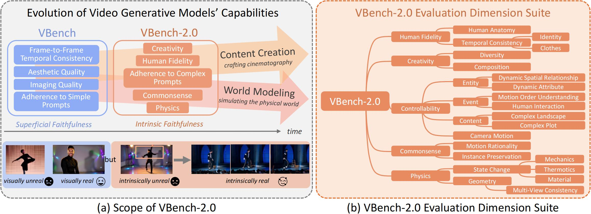
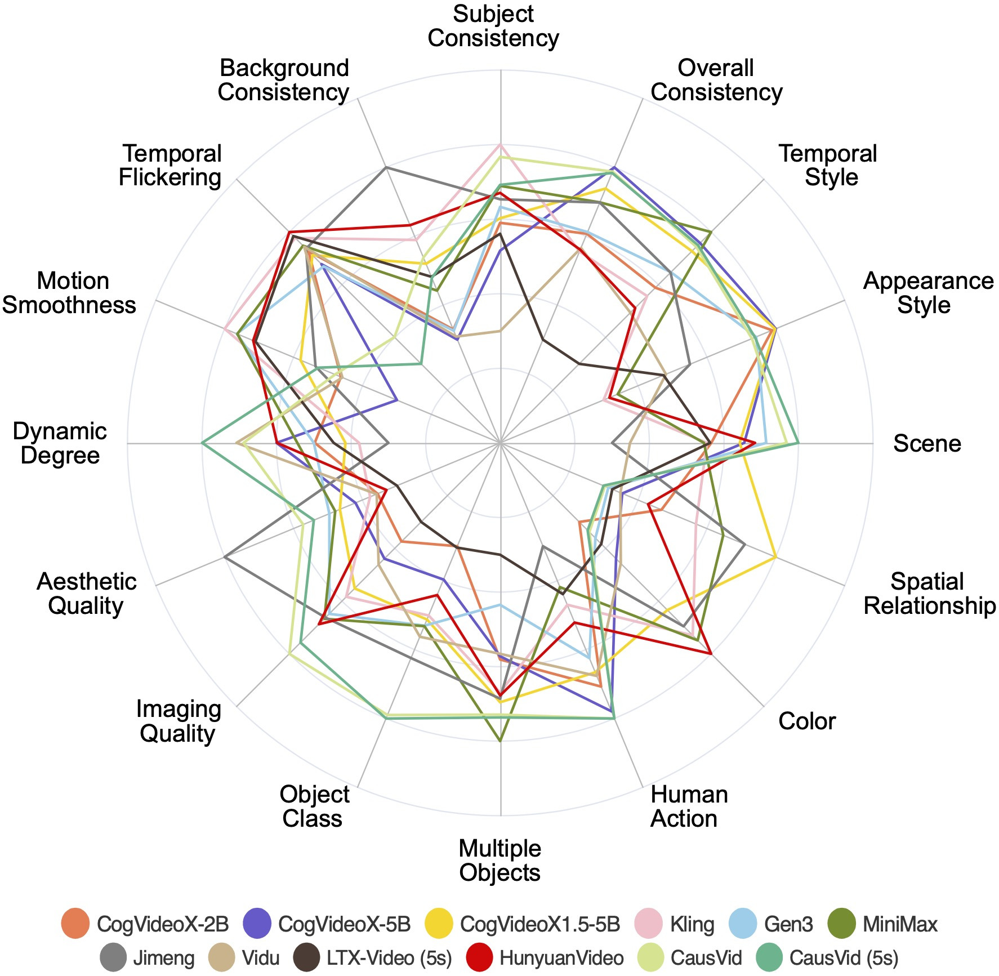
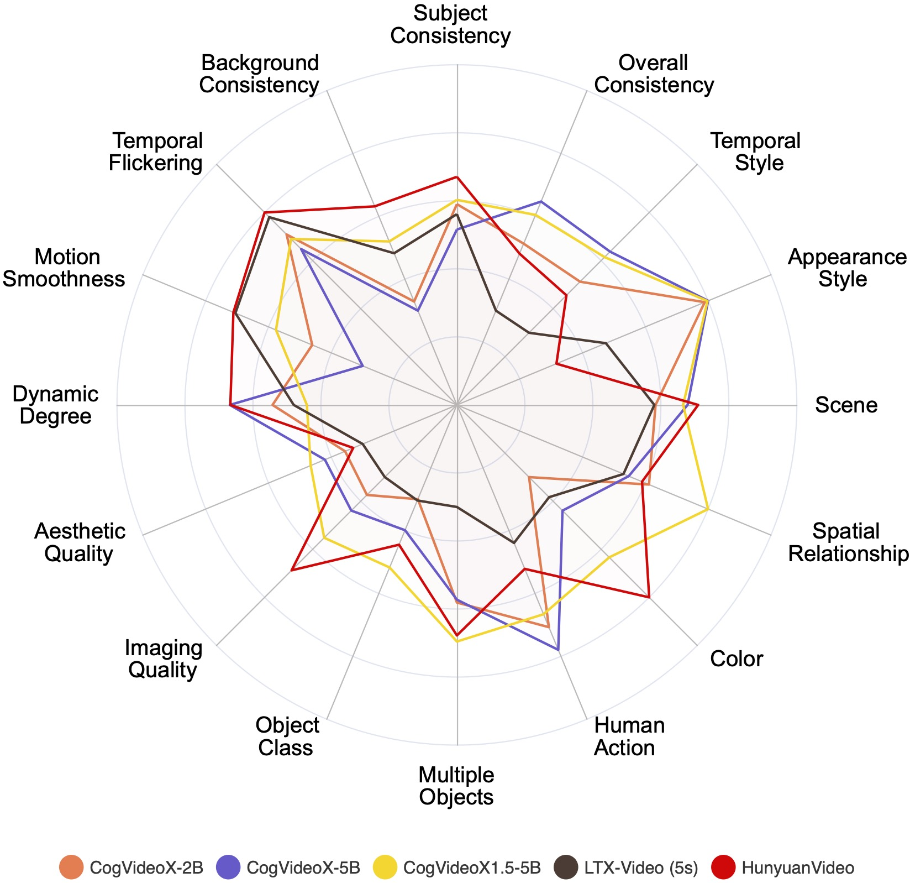
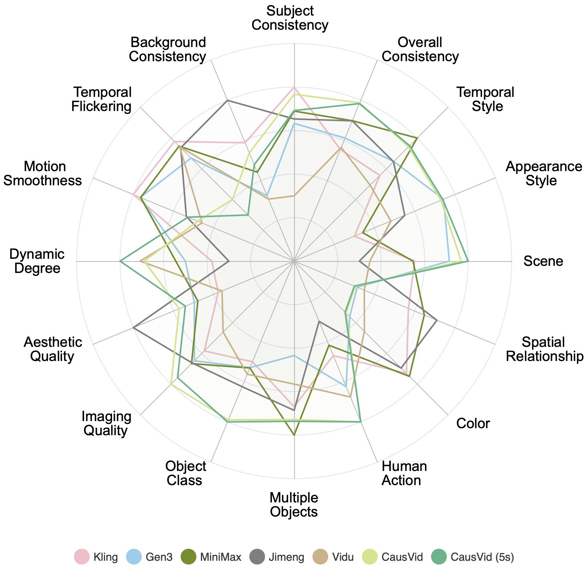

**How to Reach Us:**
- Code Issues: Please open an [issue](https://github.com/Vchitect/VBench/issues) in our GitHub repository for any problems or bugs.
- Evaluation Requests: To submit your sampled videos for evaluation, please complete this [Google Form](https://forms.gle/wHk1xe7ecvVNj7yAA).
- General Inquiries: **Check our [FAQ](https://github.com/Vchitect/VBench/blob/master/README-FAQ.md)** for common questions. For other questions, contact Ziqi Huang at ZIQI002 [at] e [dot] ntu [dot] edu [dot] sg. 

<!-- [](https://arxiv.org/abs/2311.99999) -->
[](https://arxiv.org/abs/2311.17982)
[](https://arxiv.org/abs/2411.13503)
[](https://arxiv.org/abs/2503.21755)
[](https://huggingface.co/spaces/Vchitect/VBench_Leaderboard)
[](https://huggingface.co/spaces/Vchitect/VBench_Video_Arena)
[](https://huggingface.co/spaces/Vchitect/VBench2.0_Video_Arena)
[](https://vchitect.github.io/VBench-project/)
[](https://vchitect.github.io/VBench-2.0-project/)
[](https://drive.google.com/drive/folders/1on66fnZ8atRoLDimcAXMxSwRxqN8_0yS?usp=sharing)
[](https://pypi.org/project/vbench/)
[](https://www.youtube.com/watch?v=7IhCC8Qqn8Y)
[](https://www.youtube.com/watch?v=kJrzKy9tgAc)


This repository contains the implementation of the following paper and its related serial works in progress. We evaluate video generative models!
> **VBench: Comprehensive Benchmark Suite for Video Generative Models**<br>
> [Ziqi Huang](https://ziqihuangg.github.io/)<sup>∗</sup>, [Yinan He](https://github.com/yinanhe)<sup>∗</sup>, [Jiashuo Yu](https://scholar.google.com/citations?user=iH0Aq0YAAAAJ&hl=zh-CN)<sup>∗</sup>, [Fan Zhang](https://github.com/zhangfan-p)<sup>∗</sup>, [Chenyang Si](https://chenyangsi.top/), [Yuming Jiang](https://yumingj.github.io/), [Yuanhan Zhang](https://zhangyuanhan-ai.github.io/),  [Tianxing Wu](https://tianxingwu.github.io/), [Qingyang Jin](https://github.com/Vchitect/VBench), [Nattapol Chanpaisit](https://nattapolchan.github.io/me), [Yaohui Wang](https://wyhsirius.github.io/), [Xinyuan Chen](https://scholar.google.com/citations?user=3fWSC8YAAAAJ), [Limin Wang](https://wanglimin.github.io), [Dahua Lin](http://dahua.site/)<sup>+</sup>, [Yu Qiao](http://mmlab.siat.ac.cn/yuqiao/index.html)<sup>+</sup>, [Ziwei Liu](https://liuziwei7.github.io/)<sup>+</sup><br>
> IEEE/CVF Conference on Computer Vision and Pattern Recognition (**CVPR**), 2024


> **VBench++: Comprehensive and Versatile Benchmark Suite for Video Generative Models**<br>
> [Ziqi Huang](https://ziqihuangg.github.io/)<sup>∗</sup>, [Fan Zhang](https://github.com/zhangfan-p)<sup>∗</sup>, [Xiaojie Xu](https://github.com/xjxu21), [Yinan He](https://github.com/yinanhe), [Jiashuo Yu](https://scholar.google.com/citations?user=iH0Aq0YAAAAJ&hl=zh-CN), [Ziyue Dong](https://github.com/DZY-irene), [Qianli Ma](https://github.com/MqLeet), [Nattapol Chanpaisit](https://nattapolchan.github.io/me), [Chenyang Si](https://chenyangsi.top/), [Yuming Jiang](https://yumingj.github.io/), [Yaohui Wang](https://wyhsirius.github.io/), [Xinyuan Chen](https://scholar.google.com/citations?user=3fWSC8YAAAAJ), [Ying-Cong Chen](https://www.yingcong.me/), [Limin Wang](https://wanglimin.github.io), [Dahua Lin](http://dahua.site/)<sup>+</sup>, [Yu Qiao](http://mmlab.siat.ac.cn/yuqiao/index.html)<sup>+</sup>, [Ziwei Liu](https://liuziwei7.github.io/)<sup>+</sup><br>
<!-- > IEEE/CVF Conference on Computer Vision and Pattern Recognition (**CVPR**), 2024 -->

> **VBench-2.0: Advancing Video Generation Benchmark Suite for Intrinsic Faithfulness**<br>
> [Dian Zheng](https://zhengdian1.github.io/)<sup>∗</sup>, [Ziqi Huang](https://ziqihuangg.github.io/)<sup>∗</sup>, [Hongbo Liu](https://github.com/Alexios-hub), [Kai Zou](https://github.com/Jacky-hate), [Yinan He](https://github.com/yinanhe), [Fan Zhang](https://github.com/zhangfan-p), [Yuanhan Zhang](https://zhangyuanhan-ai.github.io/),  [Jingwen He](https://scholar.google.com/citations?user=GUxrycUAAAAJ&hl=zh-CN), [Wei-Shi Zheng](https://www.isee-ai.cn/~zhwshi/)<sup>+</sup>, [Yu Qiao](http://mmlab.siat.ac.cn/yuqiao/index.html)<sup>+</sup>, [Ziwei Liu](https://liuziwei7.github.io/)<sup>+</sup><br>


### Table of Contents
- [Updates](#updates)
- [Overview](#overview)
- [Evaluation Results](#evaluation_results)
- [Video Generation Models Info](https://github.com/Vchitect/VBench/tree/master/sampled_videos#what-are-the-details-of-the-video-generation-models)
- [Installation](#installation)
- [Usage](#usage)
- [Prompt Suite](#prompt_suite)
- [Sampled Videos](#sampled_videos)
- [Evaluation Method Suite](#evaluation_method_suite)
- [Citation and Acknowledgement](#citation_and_acknowledgement)

<a name="updates"></a>
## :fire: Updates
- [05/2025] We support **evaluating customized videos** for VBench-2.0! See [here](https://github.com/Vchitect/VBench/tree/master/VBench-2.0#new-evaluating-single-dimension-of-your-own-videos) for instructions.
- [04/2025] **[Human Anomaly Detection for AIGC Videos](https://github.com/Vchitect/VBench/tree/master/VBench-2.0/vbench2/third_party/ViTDetector):** We release the pipeline for evaluating human anatomical quality in AIGC videos, including a manually human anomaly dataset on real and AIGC videos, and the training pipeline for anomaly detection.
- [03/2025] :fire: **Major Update! We released [VBench-2.0](https://github.com/Vchitect/VBench/tree/master/VBench-2.0)!** :fire: Video generative models have progressed from achieving *superficial faithfulness* in fundamental technical aspects such as pixel fidelity and basic prompt adherence, to addressing more complex challenges associated with *intrinsic faithfulness*, including commonsense reasoning, physics-based realism, human motion, and creative composition. While VBench primarily assessed early-stage technical quality, VBench-2.0 expands the benchmarking framework to evaluate these advanced capabilities, ensuring a more comprehensive assessment of next-generation models.
- [01/2025] **PyPI Updates: v0.1.5** preprocessing bug fixes, torch>=2.0 support.
- [01/2025] **VBench Arena** released: [](https://huggingface.co/spaces/Vchitect/VBench_Video_Arena) View the generated videos here, and vote for your preferred video. This demo features over 180,000 generated videos, and you can explore videos generated by your chosen models (we already support 40 models) following your chosen text prompts.
- [11/2024] **VBench++** released: [](https://arxiv.org/abs/2411.13503)
- [09/2024] **VBench-Long Leaderboard** available: Our VBench-Long leaderboard now has 10 long video generation models. VBench leaderboard now has 40 text-to-video (both long and short) models. All video generative models are encouraged to participate! [](https://huggingface.co/spaces/Vchitect/VBench_Leaderboard)

- [09/2024] **PyPI Updates: PyPI package is updated to version [0.1.4](https://github.com/Vchitect/VBench/releases/tag/v0.1.4):** bug fixes and multi-gpu inference.
- [08/2024] **Longer and More Descriptive Prompts**: [Available Here](https://github.com/Vchitect/VBench/tree/master/prompts/gpt_enhanced_prompts)! We follow [CogVideoX](https://github.com/THUDM/CogVideo?tab=readme-ov-file#prompt-optimization)'s prompt optimization technique to enhance VBench prompts using GPT-4o, making them longer and more descriptive without altering their original meaning.
- [08/2024] **VBench Leaderboard** update: Our leaderboard has 28 *T2V models*, 12 *I2V models* so far. All video generative models are encouraged to participate! [](https://huggingface.co/spaces/Vchitect/VBench_Leaderboard)
- [06/2024] :fire: **[VBench-Long](https://github.com/Vchitect/VBench/tree/master/vbench2_beta_long)** :fire: is ready to use for evaluating longer Sora-like videos!
- [06/2024] **Model Info Documentation**: Information on video generative models in our [VBench Leaderboard](https://huggingface.co/spaces/Vchitect/VBench_Leaderboard) 
 is documented [HERE](https://github.com/Vchitect/VBench/tree/master/sampled_videos#what-are-the-details-of-the-video-generation-models).
- [05/2024] **PyPI Update**: PyPI package `vbench` is updated to version 0.1.2. This includes changes in the preprocessing for high-resolution images/videos for `imaging_quality`, support for evaluating customized videos, and minor bug fixes.
- [04/2024] We release all the videos we sampled and used for VBench evaluation. [](https://drive.google.com/drive/folders/13pH95aUN-hVgybUZJBx1e_08R6xhZs5X) See details [here](https://github.com/Vchitect/VBench/tree/master/sampled_videos).
- [03/2024] :fire: **[VBench-Trustworthiness](https://github.com/Vchitect/VBench/tree/master/vbench2_beta_trustworthiness)** :fire: We now support evaluating the **trustworthiness** (*e.g.*, culture, fairness, bias, safety) of video generative models.
- [03/2024] :fire: **[VBench-I2V](https://github.com/Vchitect/VBench/tree/master/vbench2_beta_i2v)** :fire: We now support evaluating **Image-to-Video (I2V)** models. We also provide [Image Suite](https://drive.google.com/drive/folders/1fdOZKQ7HWZtgutCKKA7CMzOhMFUGv4Zx?usp=sharing).
- [03/2024] We support **evaluating customized videos**! See [here](https://github.com/Vchitect/VBench/?tab=readme-ov-file#new-evaluate-your-own-videos) for instructions.
- [01/2024] PyPI package is released! [](https://pypi.org/project/vbench/). Simply `pip install vbench`.
- [12/2023] :fire: **[VBench](https://github.com/Vchitect/VBench?tab=readme-ov-file#usage)** :fire: Evaluation code released for 16 **Text-to-Video (T2V) evaluation** dimensions. 
    - `['subject_consistency', 'background_consistency', 'temporal_flickering', 'motion_smoothness', 'dynamic_degree', 'aesthetic_quality', 'imaging_quality', 'object_class', 'multiple_objects', 'human_action', 'color', 'spatial_relationship', 'scene', 'temporal_style', 'appearance_style', 'overall_consistency']`
- [11/2023] Prompt Suites released. (See prompt lists [here](https://github.com/Vchitect/VBench/tree/master/prompts))
  
<a name="overview"></a>
## :mega: Overview

### VBench-1.0

We propose **VBench**, a comprehensive benchmark suite for video generative models. We design a comprehensive and hierarchical <b>Evaluation Dimension Suite</b> to decompose "video generation quality" into multiple well-defined dimensions to facilitate fine-grained and objective evaluation. For each dimension and each content category, we carefully design a <b>Prompt Suite</b> as test cases, and sample <b>Generated Videos</b> from a set of video generation models. For each evaluation dimension, we specifically design an <b>Evaluation Method Suite</b>, which uses carefully crafted method or designated pipeline for automatic objective evaluation. We also conduct <b>Human Preference Annotation</b> for the generated videos for each dimension, and show that VBench evaluation results are <b>well aligned with human perceptions</b>. VBench can provide valuable insights from multiple perspectives. <b>VBench++</b> supports a wide range of video generation tasks, including text-to-video and image-to-video, with an adaptive Image Suite for fair evaluation across different settings. It evaluates not only technical quality but also the trustworthiness of generative models, offering a comprehensive view of model performance. We continually incorporate more video generative models into VBench to inform the community about the evolving landscape of video generation.

### VBench-2.0

Overview of VBench-2.0. (a) Scope of VBench-2.0. Video generative models have progressed from achieving superficial faithfulness in fundamental technical aspects such as pixel fidelity and basic prompt adherence, to addressing more complex challenges associated with intrinsic faithfulness, including commonsense reasoning, physics-based realism, human motion, and creative composition. While VBench primarily assessed early-stage technical quality, VBench-2.0 expands the benchmarking framework to evaluate these advanced capabilities, ensuring a more comprehensive assessment of next-generation models. (b) Evaluation Dimension of VBench-2.0. VBench-2.0 introduces a structured evaluation suite comprising five broad categories and 18 fine-grained capability dimensions.

<a name="evaluation_results"></a>
## :mortar_board: Evaluation Results

***See our leaderboard for the most updated ranking and numerical results (with models like Gen-3, Kling, Pika)***. [](https://huggingface.co/spaces/Vchitect/VBench_Leaderboard)

<p align="center">
  
</p>
We visualize the evaluation results of the 12 most recent top-performing long video generation models across 16 VBench dimensions.

<p align="center">
  
  
</p>

Additionally, we present radar charts separately for the evaluation results of open-source and closed-source models. The results are normalized per dimension for clearer comparisons.

#### :trophy: Leaderboard

See numeric values at our [Leaderboard](https://huggingface.co/spaces/Vchitect/VBench_Leaderboard) :1st_place_medal::2nd_place_medal::3rd_place_medal:


#### :film_projector: Model Info
See [model info](https://github.com/Vchitect/VBench/tree/master/sampled_videos#what-are-the-details-of-the-video-generation-models) for video generation models we used for evaluation.

<!-- The values have been normalized for better readability of the chart. The normalization process involves scaling each set of performance values to a common scale between 0.3 and 0.8. The formula used for normalization is: (value - min value) / (max value - min value). -->

<a name="installation"></a>
## :hammer: Installation
### Install with pip 
```
pip install torch torchvision --index-url https://download.pytorch.org/whl/cu118 # or any other PyTorch version with CUDA<=12.1
pip install vbench
```

To evaluate some video generation ability aspects, you need to install [detectron2](https://github.com/facebookresearch/detectron2) via:
   ```
   pip install detectron2@git+https://github.com/facebookresearch/detectron2.git
   ```
    
If there is an error during [detectron2](https://github.com/facebookresearch/detectron2) installation, see [here](https://detectron2.readthedocs.io/en/latest/tutorials/install.html). Detectron2 is working only with CUDA 12.1 or 11.X.

Download [VBench_full_info.json](https://github.com/Vchitect/VBench/blob/master/vbench/VBench_full_info.json) to your running directory to read the benchmark prompt suites.

### Install with git clone
    git clone https://github.com/Vchitect/VBench.git
    pip install torch torchvision --index-url https://download.pytorch.org/whl/cu118 # or other version with CUDA<=12.1
    pip install VBench
    
If there is an error during [detectron2](https://github.com/facebookresearch/detectron2) installation, see [here](https://detectron2.readthedocs.io/en/latest/tutorials/install.html).

<a name="usage"></a>
## Usage
Use VBench to evaluate videos, and video generative models.
- A Side Note: VBench is designed for evaluating different models on a standard benchmark. Therefore, by default, we enforce evaluation on the **standard VBench prompt lists** to ensure **fair comparisons** among different video generation models. That's also why we give warnings when a required video is not found. This is done via defining the set of prompts in [VBench_full_info.json](https://github.com/Vchitect/VBench/blob/master/vbench/VBench_full_info.json). However, we understand that many users would like to use VBench to evaluate their own videos, or videos generated from prompts that does not belong to the VBench Prompt Suite, so we also added the function of **Evaluating Your Own Videos**. Simply set `mode=custom_input`, and you can evaluate your own videos.


### **[New]** Evaluate Your Own Videos
We support evaluating any video. Simply provide the path to the video file, or the path to the folder that contains your videos. There is no requirement on the videos' names.
- Note: We support customized videos / prompts for the following dimensions: `'subject_consistency', 'background_consistency', 'motion_smoothness', 'dynamic_degree', 'aesthetic_quality', 'imaging_quality'`


To evaluate videos with customized input prompt, run our script with `--mode=custom_input`:
```
python evaluate.py \
    --dimension $DIMENSION \
    --videos_path /path/to/folder_or_video/ \
    --mode=custom_input
```
alternatively you can use our command:
```
vbench evaluate \
    --dimension $DIMENSION \
    --videos_path /path/to/folder_or_video/ \
    --mode=custom_input
```

To evaluate using multiple gpus, we can use the following commands:
```
torchrun --nproc_per_node=${GPUS} --standalone evaluate.py ...args...
```
or 
```
vbench evaluate --ngpus=${GPUS} ...args...
```

### Evaluation on the Standard Prompt Suite of VBench

##### Command Line 
```bash
vbench evaluate --videos_path $VIDEO_PATH --dimension $DIMENSION
```
For example:
```bash
vbench evaluate --videos_path "sampled_videos/lavie/human_action" --dimension "human_action"
```
##### Python
```python
from vbench import VBench
my_VBench = VBench(device, <path/to/VBench_full_info.json>, <path/to/save/dir>)
my_VBench.evaluate(
    videos_path = <video_path>,
    name = <name>,
    dimension_list = [<dimension>, <dimension>, ...],
)
```
For example: 
```python
from vbench import VBench
my_VBench = VBench(device, "vbench/VBench_full_info.json", "evaluation_results")
my_VBench.evaluate(
    videos_path = "sampled_videos/lavie/human_action",
    name = "lavie_human_action",
    dimension_list = ["human_action"],
)
```

### Evaluation of Different Content Categories

##### command line 
```bash
vbench evaluate \
    --videos_path $VIDEO_PATH \
    --dimension $DIMENSION \
    --mode=vbench_category \
    --category=$CATEGORY
```
or 
```
python evaluate.py \
    --dimension $DIMENSION \
    --videos_path /path/to/folder_or_video/ \
    --mode=vbench_category
```

### Example of Evaluating VideoCrafter-1.0
We have provided scripts to download VideoCrafter-1.0 samples, and the corresponding evaluation scripts.
```
# download sampled videos
sh scripts/download_videocrafter1.sh

# evaluate VideoCrafter-1.0
sh scripts/evaluate_videocrafter1.sh
```
### Submit to Leaderboard
We have provided scripts for calculating the `Total Score`, `Quality Score`, and `Semantic Score` in the Leaderboard. You can run them locally to obtain the aggregate scores or as a final check before submitting to the Leaderboard.

```bash
# Pack the evaluation results into a zip file.
cd evaluation_results
zip -r ../evaluation_results.zip .

# [Optional] get the total score of your submission file.
python scripts/cal_final_score.py --zip_file {path_to_evaluation_results.zip} --model_name {your_model_name}
```

You can submit the json file to [HuggingFace](https://huggingface.co/spaces/Vchitect/VBench_Leaderboard)

### How to Calculate Total Score

To calculate the **Total Score**, we follow these steps:

1. **Normalization**:  
   Each dimension's results are normalized using the following formula:

    ```bash
    Normalized Score = (dim_score - min_val) / (max_val - min_val)
    ```

2. **Quality Score**:  
   The `Quality Score` is a weighted average of the following dimensions:  
   **subject consistency**, **background consistency**, **temporal flickering**, **motion smoothness**, **aesthetic quality**, **imaging quality**, and **dynamic degree**.

3. **Semantic Score**:  
   The `Semantic Score` is a weighted average of the following dimensions:  
   **object class**, **multiple objects**, **human action**, **color**, **spatial relationship**, **scene**, **appearance style**, **temporal style**, and **overall consistency**.


4. **Weighted Average Calculation**:  
   The **Total Score** is a weighted average of the `Quality Score` and `Semantic Score`:
    ```bash
    Total Score = w1 * Quality Score + w2 * Semantic Score
    ```

   
The minimum and maximum values used for normalization in each dimension, as well as the weighting coefficients for the average calculation, can be found in the `scripts/constant.py` file.

### Total Score for VBench-I2V
For Total Score Calculation for VBench-I2V, you can refer to [link](https://github.com/Vchitect/VBench/tree/master/vbench2_beta_i2v#submit-to-leaderboard).

<a name="pretrained_models"></a>
## :gem: Pre-Trained Models
[Optional] Please download the pre-trained weights according to the guidance in the `model_path.txt` file for each model in the `pretrained` folder to `~/.cache/vbench`.

<a name="prompt_suite"></a>
## :bookmark_tabs: Prompt Suite

We provide prompt lists are at `prompts/`. 

Check out [details of prompt suites](https://github.com/Vchitect/VBench/tree/master/prompts), and instructions for [**how to sample videos for evaluation**](https://github.com/Vchitect/VBench/tree/master/prompts).

<a name="sampled_videos"></a>
## :bookmark_tabs: Sampled Videos

[](https://drive.google.com/drive/folders/13pH95aUN-hVgybUZJBx1e_08R6xhZs5X)

To facilitate future research and to ensure full transparency, we release all the videos we sampled and used for VBench evaluation. You can download them on [Google Drive](https://drive.google.com/drive/folders/13pH95aUN-hVgybUZJBx1e_08R6xhZs5X).

See detailed explanations of the sampled videos [here](https://github.com/Vchitect/VBench/tree/master/sampled_videos).

We also provide detailed setting for the models under evaluation [here](https://github.com/Vchitect/VBench/tree/master/sampled_videos#what-are-the-details-of-the-video-generation-models).

<a name="evaluation_method_suite"></a>
## :surfer: Evaluation Method Suite

To perform evaluation on one dimension, run this:
```
python evaluate.py --videos_path $VIDEOS_PATH --dimension $DIMENSION
```
- The complete list of dimensions:
    ```
    ['subject_consistency', 'background_consistency', 'temporal_flickering', 'motion_smoothness', 'dynamic_degree', 'aesthetic_quality', 'imaging_quality', 'object_class', 'multiple_objects', 'human_action', 'color', 'spatial_relationship', 'scene', 'temporal_style', 'appearance_style', 'overall_consistency']
    ```

Alternatively, you can evaluate multiple models and multiple dimensions using this script:
```
bash evaluate.sh
```
- The default sampled video paths:
    ```
    vbench_videos/{model}/{dimension}/{prompt}-{index}.mp4/gif
    ```


#### Before evaluating the temporal flickering dimension, it is necessary to filter out the static videos first.
To filter static videos in the temporal flickering dimension, run this:
```
# This only filter out static videos whose prompt matches the prompt in the temporal_flickering.
python static_filter.py --videos_path $VIDEOS_PATH
```
You can adjust the filtering scope by:
```
# 1. Change the filtering scope to consider all files inside videos_path for filtering.
python static_filter.py --videos_path $VIDEOS_PATH --filter_scope all

# 2. Specify the path to a JSON file ($filename) to consider only videos whose prompts match those listed in $filename.
python static_filter.py --videos_path $VIDEOS_PATH --filter_scope $filename
```

<a name="citation_and_acknowledgement"></a>
## :black_nib: Citation

   If you find our repo useful for your research, please consider citing our paper:

   ```bibtex
    @InProceedings{huang2023vbench,
        title={{VBench}: Comprehensive Benchmark Suite for Video Generative Models},
        author={Huang, Ziqi and He, Yinan and Yu, Jiashuo and Zhang, Fan and Si, Chenyang and Jiang, Yuming and Zhang, Yuanhan and Wu, Tianxing and Jin, Qingyang and Chanpaisit, Nattapol and Wang, Yaohui and Chen, Xinyuan and Wang, Limin and Lin, Dahua and Qiao, Yu and Liu, Ziwei},
        booktitle={Proceedings of the IEEE/CVF Conference on Computer Vision and Pattern Recognition},
        year={2024}
    }

    @article{huang2024vbench++,
        title={{VBench++}: Comprehensive and Versatile Benchmark Suite for Video Generative Models},
        author={Huang, Ziqi and Zhang, Fan and Xu, Xiaojie and He, Yinan and Yu, Jiashuo and Dong, Ziyue and Ma, Qianli and Chanpaisit, Nattapol and Si, Chenyang and Jiang, Yuming and Wang, Yaohui and Chen, Xinyuan and Chen, Ying-Cong and Wang, Limin and Lin, Dahua and Qiao, Yu and Liu, Ziwei},
        journal={arXiv preprint arXiv:2411.13503},
        year={2024}
    }

    @article{zheng2025vbench2,
        title={{VBench-2.0}: Advancing Video Generation Benchmark Suite for Intrinsic Faithfulness},
        author={Zheng, Dian and Huang, Ziqi and Liu, Hongbo and Zou, Kai and He, Yinan and Zhang, Fan and Zhang, Yuanhan and He, Jingwen and Zheng, Wei-Shi and Qiao, Yu and Liu, Ziwei},
        journal={arXiv preprint arXiv:2503.21755},
        year={2025}
    }
   ```

## :hearts: Acknowledgement

#### :muscle: VBench Contributors
Order is based on the time joining the project: 
> [Ziqi Huang](https://ziqihuangg.github.io/), [Yinan He](https://github.com/yinanhe), [Jiashuo Yu](https://scholar.google.com/citations?user=iH0Aq0YAAAAJ&hl=zh-CN), [Fan Zhang](https://github.com/zhangfan-p), [Nattapol Chanpaisit](https://nattapolchan.github.io/me), [Xiaojie Xu](https://github.com/xjxu21), [Qianli Ma](https://github.com/MqLeet), [Ziyue Dong](https://github.com/DZY-irene), [Dian Zheng](https://zhengdian1.github.io/), [Hongbo Liu](https://github.com/Alexios-hub), [Kai Zou](https://github.com/Jacky-hate)

#### :hugs: Open-Sourced Repositories
This project wouldn't be possible without the following open-sourced repositories:
[AMT](https://github.com/MCG-NKU/AMT/), [UMT](https://github.com/OpenGVLab/unmasked_teacher), [RAM](https://github.com/xinyu1205/recognize-anything), [CLIP](https://github.com/openai/CLIP), [RAFT](https://github.com/princeton-vl/RAFT), [GRiT](https://github.com/JialianW/GRiT), [IQA-PyTorch](https://github.com/chaofengc/IQA-PyTorch/), [ViCLIP](https://github.com/OpenGVLab/InternVideo/tree/main/Data/InternVid), and [LAION Aesthetic Predictor](https://github.com/LAION-AI/aesthetic-predictor).

## Related Links

We are putting together [Awesome-Evaluation-of-Visual-Generation](https://github.com/ziqihuangg/Awesome-Evaluation-of-Visual-Generation), which collects works for evaluating visual generation.

Our related projects: [Evaluation Agent](https://vchitect.github.io/Evaluation-Agent-project/)

```bibtex
@article{zhang2024evaluationagent,
    title = {Evaluation Agent: Efficient and Promptable Evaluation Framework for Visual Generative Models},
    author = {Zhang, Fan and Tian, Shulin and Huang, Ziqi and Qiao, Yu and Liu, Ziwei},
    journal={arXiv preprint arXiv:2412.09645},
    year = {2024}
}
```
