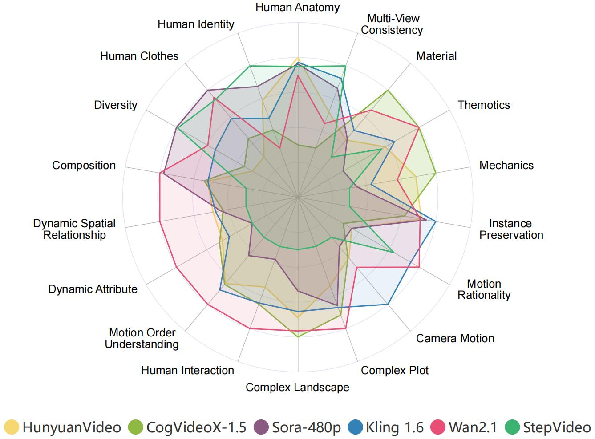

[](https://arxiv.org/abs/2503.21755)

[](https://vchitect.github.io/VBench-2.0-project/)
[](https://www.youtube.com/watch?v=kJrzKy9tgAc)


This repository contains the implementation of the following paper.

> **VBench-2.0: Advancing Video Generation Benchmark Suite for Intrinsic Faithfulness**<br>
> [Dian Zheng](https://zhengdian1.github.io/)<sup>∗</sup>, [Ziqi Huang](https://ziqihuangg.github.io/)<sup>∗</sup>, [Hongbo Liu](https://github.com/Alexios-hub), [Kai Zou](https://github.com/Jacky-hate), [Yinan He](https://github.com/yinanhe), [Fan Zhang](https://github.com/zhangfan-p), [Yuanhan Zhang](https://zhangyuanhan-ai.github.io/),  [Jingwen He](https://scholar.google.com/citations?user=GUxrycUAAAAJ&hl=zh-CN), [Wei-Shi Zheng](https://www.isee-ai.cn/~zhwshi/)<sup>+</sup>, [Yu Qiao](http://mmlab.siat.ac.cn/yuqiao/index.html)<sup>+</sup>, [Ziwei Liu](https://liuziwei7.github.io/)<sup>+</sup><br>


### Table of Contents
- [Updates](#updates)
- [Overview](#overview)
- [Evaluation Results](#evaluation_results)
- [Installation](#installation)
- [Pretrained Models](#pretrained_models)
- [Usage](#usage)
- [Prompt Suite](#prompt_suite)
- [Citation and Acknowledgement](#citation_and_acknowledgement)

<a name="updates"></a>
## :fire: Updates

- [03/2025] :fire: **Major Update! We released [VBench-2.0](https://github.com/Vchitect/VBench/tree/master/VBench-2.0)!** :fire: Video generative models have progressed from achieving *superficial faithfulness* in fundamental technical aspects such as pixel fidelity and basic prompt adherence, to addressing more complex challenges associated with *intrinsic faithfulness*, including commonsense reasoning, physics-based realism, human motion, and creative composition. While VBench primarily assessed early-stage technical quality, VBench-2.0 expands the benchmarking framework to evaluate these advanced capabilities, ensuring a more comprehensive assessment of next-generation models.

<a name="overview"></a>
## :mega: Overview

Overview of VBench-2.0. (a) Scope of VBench-2.0. Video generative models have progressed from achieving superficial faithfulness in fundamental technical aspects such as pixel fidelity and basic prompt adherence, to addressing more complex challenges associated with intrinsic faithfulness, including commonsense reasoning, physics-based realism, human motion, and creative composition. While VBench primarily assessed early-stage technical quality, VBench-2.0 expands the benchmarking framework to evaluate these advanced capabilities, ensuring a more comprehensive assessment of next-generation models. (b) Evaluation Dimension of VBench-2.0. VBench-2.0 introduces a structured evaluation suite comprising five broad categories and 18 fine-grained capability dimensions.

<a name="evaluation_results"></a>
## :mortar_board: Evaluation Results

<p align="center">
  
</p>
We visualize the evaluation results of the 6 recent top-performing video generative models across 18 VBench-2.0 dimensions.

<a name="installation"></a>
## :hammer: Installation
### Install with pip 
```
conda create -n vbench2 python=3.10 -y
conda activate vbench2
conda install psutil
pip install torch==2.5.1 torchvision==0.20.1 torchaudio==2.5.1 --index-url https://download.pytorch.org/whl/cu118 # or cu121
#ensure your cuda version is 11.8 or 12.1
python -m pip install ninja
python -m pip install git+https://github.com/Dao-AILab/flash-attention.git@v2.7.2.post1
pip install -r requirement.txt
```
There will be an error about the mmcv version exceeds 2.1.0, users could directly change the `mmcv_maximum_version` to `2.3.0` in `Your_PATH_to_Anaconda/env/vbench2/lib/python3.10/site-packages/mmdet/__init__.py` and `Your_PATH_to_Anaconda/env/vbench2/lib/python3.10/site-packages/mmyolo/__init__.py`

<a name="pretrained_models"></a>
## Pretrained Models
[Optional] Please download the pre-trained weights according to the guidance in the `download.sh` file for each model in the `pretrained` folder to `~/.cache/vbench2`.
*Note that for `LLaVA-Video-7B-Qwen2` and `Qwen2.5-7B-Instruct`, we highly recommend the users to download the model before evaluation based on the `download.sh` in `pretrained`*


<a name="usage"></a>
## Usage
Use VBench-2.0 to evaluate videos, and video generative models.
- A Side Note: VBench-2.0 is designed for evaluating different models on a standard benchmark. Therefore, by default, we enforce evaluation on the **standard VBench-2.0 prompt lists** to ensure **fair comparisons** among different video generation models. That's also why we give warnings when a required video is not found. This is done via defining the set of prompts in [VBench2_full_info.json](https://github.com/Vchitect/VBench/blob/master/VBench-2.0/vbench2/VBench2_full_info.json). 

### Evaluation on the Standard Prompt Suite of VBench-2.0

Evaluate 18 dimensions sequentially on a single GPU (not recommended):
```bash
bash evaluate.sh --max_parallel_tasks 1
```
Evaluate 18 dimensions on different GPUs, one dimension per GPU. You can set the total number of GPUs available for evaluation:
```bash
bash evaluate.sh --max_parallel_tasks 9
```

<a name="prompt_suite"></a>
## :bookmark_tabs: Prompt Suite

We provide prompt lists are at `prompts/`. 

Check out [details of prompt suites](https://github.com/Vchitect/VBench/tree/master/VBench-2.0/prompts), and instructions for [**how to sample videos for evaluation**](https://github.com/Vchitect/VBench/tree/master/VBench-2.0/prompts#how-to-sample-videos-for-evaluation).


<a name="citation_and_acknowledgement"></a>
## :black_nib: Citation

   If you find our repo useful for your research, please consider citing our paper:

   ```bibtex
    @article{zheng2025vbench2,
        title={VBench-2.0: Advancing Video Generation Benchmark Suite for Intrinsic Faithfulness},
        author={Zheng, Dian and Huang, Ziqi and Liu, Hongbo and Zou, Kai and He, Yinan and Zhang, Fan and Zhang, Yuanhan and He, Jingwen and Zheng, Wei-Shi and Qiao, Yu and Liu, Ziwei},
        journal={arXiv preprint arXiv:2503.21755},
        year={2025}
    }

    @InProceedings{huang2023vbench,
        title={{VBench}: Comprehensive Benchmark Suite for Video Generative Models},
        author={Huang, Ziqi and He, Yinan and Yu, Jiashuo and Zhang, Fan and Si, Chenyang and Jiang, Yuming and Zhang, Yuanhan and Wu, Tianxing and Jin, Qingyang and Chanpaisit, Nattapol and Wang, Yaohui and Chen, Xinyuan and Wang, Limin and Lin, Dahua and Qiao, Yu and Liu, Ziwei},
        booktitle={Proceedings of the IEEE/CVF Conference on Computer Vision and Pattern Recognition},
        year={2024}
    }

    @article{huang2024vbench++,
        title={VBench++: Comprehensive and Versatile Benchmark Suite for Video Generative Models},
        author={Huang, Ziqi and Zhang, Fan and Xu, Xiaojie and He, Yinan and Yu, Jiashuo and Dong, Ziyue and Ma, Qianli and Chanpaisit, Nattapol and Si, Chenyang and Jiang, Yuming and Wang, Yaohui and Chen, Xinyuan and Chen, Ying-Cong and Wang, Limin and Lin, Dahua and Qiao, Yu and Liu, Ziwei},
        journal={arXiv preprint arXiv:2411.13503},
        year={2024}
    }

   ```


## :hearts: Acknowledgement

**VBench-2.0** is currently maintained by [Dian Zheng](https://zhengdian1.github.io/) and [Ziqi Huang](https://ziqihuangg.github.io/).


#### :hugs: Open-Sourced Repositories
This project wouldn't be possible without the following open-sourced repositories:
[LLaVA-Video](https://github.com/LLaVA-VL/LLaVA-NeXT), [Qwen2.5](https://github.com/QwenLM/Qwen2.5), [CoTracker](https://github.com/facebookresearch/co-tracker), [Insightface](https://github.com/deepinsight/insightface), [CLIP](https://github.com/openai/CLIP), [RAFT](https://github.com/princeton-vl/RAFT), [YOLO_World](https://github.com/AILab-CVC/YOLO-World).

## Related Links

We are putting together [Awesome-Evaluation-of-Visual-Generation](https://github.com/ziqihuangg/Awesome-Evaluation-of-Visual-Generation), which collects works for evaluating visual generation.
