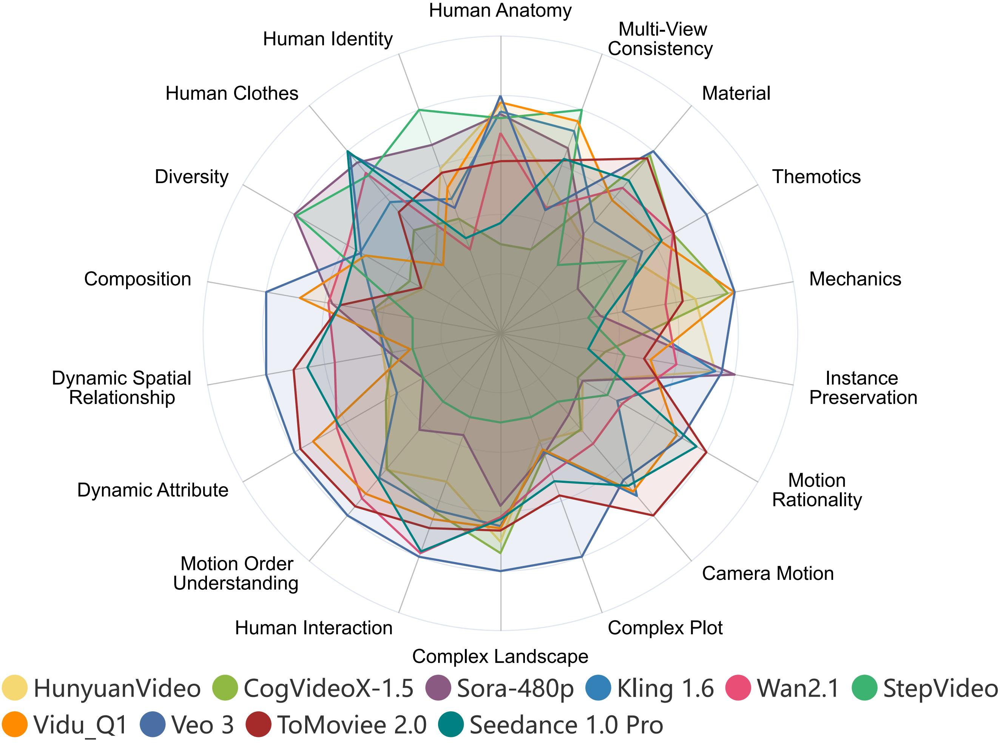

[](https://arxiv.org/abs/2411.13503)
[](https://vchitect.github.io/VBench-2.0-project/)
<!-- [](https://hits.seeyoufarm.com) -->


This repository contains the implementation of the following paper and its related serial works in progress. We evaluate video generative models!

> **VBench-2.0: Advancing Video Generation Benchmark Suite for Intrinsic Faithfulness**<br>
> [Dian Zheng](https://zhengdian1.github.io/)<sup>∗</sup>, [Ziqi Huang](https://ziqihuangg.github.io/)<sup>∗</sup>, [Hongbo Liu](https://github.com/Alexios-hub), [Kai Zou](https://github.com/Jacky-hate), [Yinan He](https://github.com/yinanhe), [Fan Zhang](https://github.com/zhangfan-p), [Yuanhan Zhang](https://zhangyuanhan-ai.github.io/),  [Jingwen He](https://scholar.google.com/citations?user=GUxrycUAAAAJ&hl=zh-CN), [Wei-Shi Zheng](https://www.isee-ai.cn/~zhwshi/)<sup>+</sup>, [Yu Qiao](http://mmlab.siat.ac.cn/yuqiao/index.html)<sup>+</sup>, [Ziwei Liu](https://liuziwei7.github.io/)<sup>+</sup><br>


### Table of Contents
- [Updates](#updates)
- [Overview](#overview)
- [Evaluation Results](#evaluation_results)
<!-- - [Video Generation Models Info](https://github.com/Vchitect/VBench/tree/master/sampled_videos#what-are-the-details-of-the-video-generation-models) -->
- [Installation](#installation)
- [Pretrained Models](#pretrained_models)
- [Usage](#usage)
- [Prompt Suite](#prompt_suite)
<!-- - [Sampled Videos](#sampled_videos) -->
<!-- - [Evaluation Method Suite](#evaluation_method_suite) -->
- [Citation and Acknowledgement](#citation_and_acknowledgement)

<a name="updates"></a>
## :fire: Updates

- [03/2025] :fire: **[VBench-2.0](https://github.com/Vchitect/VBench?tab=readme-ov-file#usage)** :fire: Evaluation code released for 18 **Text-to-Video (T2V) evaluation** dimensions. 
    - `['Camera_Motion', 'Complex_Landscape', 'Complex_Plot', 'Composition', 'Diversity', 'Dynamic_Attribute', 'Dynamic_Spatial_Relationship', 'Human_Anatomy', 'Human_Clothes', 'Human_Identity', 'Human_Interaction', 'Instance_Preservation', 'Material', 'Mechanics', 'Motion_Order_Understanding', 'Motion_Rationality', 'Multi-View_Consistency', 'Thermotics']`
- [03/2025] Prompt Suites released. (See prompt lists [here](https://github.com/Vchitect/VBench/tree/master/prompts))
  
<a name="overview"></a>
## :mega: Overview

We propose **VBench-2.0**, a comprehensive benchmark suite for Intrinsic Faithfulness in video generative models. We design a comprehensive and hierarchical <b>Evaluation Dimension Suite</b>  that breaks down Intrinsic Faithfulness into five main dimensions, each of which is further subdivided into several detailed sub-dimensions for more granular analysis. For each dimension, we carefully design a <b>Prompt Suite</b> as test cases, and sample <b>Generated Videos</b> from a set of video generation models. For each evaluation dimension, we specifically design an <b>Evaluation Method Suite</b>, which uses carefully crafted method or designated pipeline for automatic objective evaluation. We also conduct <b>Human Preference Annotation</b> for the generated videos for each dimension, and show that VBench-2.0 evaluation results are <b>well aligned with human perceptions</b>. VBench-2.0 can provide valuable insights from multiple perspectives.

<a name="evaluation_results"></a>
## :mortar_board: Evaluation Results

<!-- ***See our leaderboard for the most updated ranking and numerical results (with models like Gen-3, Kling, Pika)***. [](https://huggingface.co/spaces/Vchitect/VBench_Leaderboard) -->

<p align="center">
  
</p>
We visualize the evaluation results of the 6 most recent top-performing long video generation models across 18 VBench-2.0 dimensions.

<!-- #### :trophy: Leaderboard

See numeric values at our [Leaderboard](https://huggingface.co/spaces/Vchitect/VBench_Leaderboard) :1st_place_medal::2nd_place_medal::3rd_place_medal:

**How to join VBench Leaderboard?**
See the 3 options below:
| Sampling Party | Evaluation Party |              Comments                         |
| :---: |  :---: |        :--------------    | 
| VBench Team | VBench Team | We periodically allocate resources to sample newly released models and perform evaluations. You can request us to perform sampling and evaluation, but the progress depends on our available resources. |
| Your Team | VBench Team | For non-open-source models interested in joining our leaderboard, submit your video samples to us for evaluation. If you prefer to provide the evaluation results directly, see the row below. |
| Your Team | Your Team | If you have already used VBench for full evaluation in your report/paper, submit your `eval_results.zip` files to the [VBench Leaderboard](https://huggingface.co/spaces/Vchitect/VBench_Leaderboard) using the `Submit here!` form. The evaluation results will be automatically updated to the leaderboard. Also, share your model information for our records for any columns [here](https://github.com/Vchitect/VBench/tree/master/sampled_videos#what-are-the-details-of-the-video-generation-models).  | -->


<!-- #### :film_projector: Model Info
See [model info](https://github.com/Vchitect/VBench/tree/master/sampled_videos#what-are-the-details-of-the-video-generation-models) for video generation models we used for evaluation.

#### Evaluation Criterion

- For videos with a duration `>= 5.0s`, we use [**VBench-Long**](https://github.com/Vchitect/VBench/tree/master/vbench2_beta_long) for evaluation.  
- For videos with a duration `< 5.0s`, we use [**VBench**](https://github.com/Vchitect/VBench?tab=readme-ov-file#usage) for evaluation. -->

<!-- The values have been normalized for better readability of the chart. The normalization process involves scaling each set of performance values to a common scale between 0.3 and 0.8. The formula used for normalization is: (value - min value) / (max value - min value). -->

<a name="installation"></a>
## :hammer: Installation
### Install with pip 
```
conda create -n vbench2 python=3.10 -y
conda activate vbench2
conda install psutil
pip install torch==2.5.1 torchvision==0.20.1 torchaudio==2.5.1 --index-url https://download.pytorch.org/whl/cu118 # or cu121
#ensure your cuda version is 11.8 or 12.1
python -m pip install ninja
python -m pip install git+https://github.com/Dao-AILab/flash-attention.git@v2.7.2.post1
pip install -r requirement.txt
```
There will be an error about the mmcv version exceeds 2.1.0, users could directly change the `mmcv_maximum_version` to `2.3.0` in `Your_PATH_to_Anaconda/env/vbench2/lib/python3.10/site-packages/mmdet/__init__.py` and `Your_PATH_to_Anaconda/env/vbench2/lib/python3.10/site-packages/mmyolo/__init__.py`

<a name="pretrained_models"></a>
## Pretrained Models
[Optional] Please download the pre-trained weights according to the guidance in the `download.sh` file for each model in the `pretrained` folder to `~/.cache/vbench2`.
### Note that for `LLaVA-Video-7B-Qwen2` and `Qwen2.5-7B-Instruct`, we highly recommend the users to download the model before evaluation based on the `download.sh` in `pretrained`


<a name="usage"></a>
## Usage
Use VBench-2.0 to evaluate videos, and video generative models.
- A Side Note: VBench-2.0 is designed for evaluating different models on a standard benchmark. Therefore, by default, we enforce evaluation on the **standard VBench-2.0 prompt lists** to ensure **fair comparisons** among different video generation models. That's also why we give warnings when a required video is not found. This is done via defining the set of prompts in [VBench_full_info.json](https://github.com/Vchitect/VBench/blob/master/VBench-2.0/vbench2/VBench2_full_info.json). 

### Evaluation on the Standard Prompt Suite of VBench-2.0

##### Command Line 
Single gpu for 18 dimensions (not recommended):
```bash
bash evaluate.sh --max_parallel_tasks 1
```
Multi gpu for 18 dimensions (you can set the number of gpu to any value.):
```bash
bash evaluate.sh --max_parallel_tasks 9
```

<!-- ### Submit to Leaderboard
We have provided scripts for calculating the `Total Score`, `Quality Score`, and `Semantic Score` in the Leaderboard. You can run them locally to obtain the aggregate scores or as a final check before submitting to the Leaderboard.

```bash
# Pack the evaluation results into a zip file.
cd evaluation_results
zip -r ../evaluation_results.zip .

# [Optional] get the total score of your submission file.
python scripts/cal_final_score.py --zip_file {path_to_evaluation_results.zip} --model_name {your_model_name}
```

You can submit the json file to [HuggingFace](https://huggingface.co/spaces/Vchitect/VBench_Leaderboard)

### How to Calculate Total Score

To calculate the **Total Score**, we follow these steps:

1. **Normalization**:  
   Each dimension's results are normalized using the following formula:

    ```bash
    Normalized Score = (dim_score - min_val) / (max_val - min_val)
    ```

2. **Quality Score**:  
   The `Quality Score` is a weighted average of the following dimensions:  
   **subject consistency**, **background consistency**, **temporal flickering**, **motion smoothness**, **aesthetic quality**, **imaging quality**, and **dynamic degree**.

3. **Semantic Score**:  
   The `Semantic Score` is a weighted average of the following dimensions:  
   **object class**, **multiple objects**, **human action**, **color**, **spatial relationship**, **scene**, **appearance style**, **temporal style**, and **overall consistency**.


4. **Weighted Average Calculation**:  
   The **Total Score** is a weighted average of the `Quality Score` and `Semantic Score`:
    ```bash
    Total Score = w1 * Quality Score + w2 * Semantic Score
    ```

The minimum and maximum values used for normalization in each dimension, as well as the weighting coefficients for the average calculation, can be found in the `scripts/constant.py` file.

### Total Score for VBench-I2V
For Total Score Calculation for VBench-I2V, you can refer to [link](https://github.com/Vchitect/VBench/tree/master/vbench2_beta_i2v#submit-to-leaderboard). -->

<a name="prompt_suite"></a>
## :bookmark_tabs: Prompt Suite

We provide prompt lists are at `prompts/`. 

Check out [details of prompt suites](https://github.com/Vchitect/VBench/tree/master/VBench-2.0/prompts), and instructions for [**how to sample videos for evaluation**](https://github.com/Vchitect/VBench/tree/master/VBench-2.0/prompts).

<!-- <a name="sampled_videos"></a>
## :bookmark_tabs: Sampled Videos

[](https://drive.google.com/drive/folders/13pH95aUN-hVgybUZJBx1e_08R6xhZs5X)

To facilitate future research and to ensure full transparency, we release all the videos we sampled and used for VBench evaluation. You can download them on [Google Drive](https://drive.google.com/drive/folders/13pH95aUN-hVgybUZJBx1e_08R6xhZs5X).

See detailed explanations of the sampled videos [here](https://github.com/Vchitect/VBench/tree/master/sampled_videos).

We also provide detailed setting for the models under evaluation [here](https://github.com/Vchitect/VBench/tree/master/sampled_videos#what-are-the-details-of-the-video-generation-models).

<a name="evaluation_method_suite"></a>
## :surfer: Evaluation Method Suite

To perform evaluation on one dimension, run this:
```
python evaluate.py --videos_path $VIDEOS_PATH --dimension $DIMENSION
```
- The complete list of dimensions:
    ```
    ['subject_consistency', 'background_consistency', 'temporal_flickering', 'motion_smoothness', 'dynamic_degree', 'aesthetic_quality', 'imaging_quality', 'object_class', 'multiple_objects', 'human_action', 'color', 'spatial_relationship', 'scene', 'temporal_style', 'appearance_style', 'overall_consistency']
    ```

Alternatively, you can evaluate multiple models and multiple dimensions using this script:
```
bash evaluate.sh
```
- The default sampled video paths:
    ```
    vbench_videos/{model}/{dimension}/{prompt}-{index}.mp4/gif
    ``` -->

<a name="citation_and_acknowledgement"></a>
## :black_nib: Citation

   If you find our repo useful for your research, please consider citing our paper:

   ```bibtex
    @article{zheng2025vbench,
        title={VBench-2.0: Advancing Video Generation Benchmark Suite for Intrinsic Faithfulness},
        author={Zheng, Dian and Huang, Ziqi and Liu, Hongbo and Zou, Kai and He, Yinan and Zhang, Fan and Zhang, Yuanhan and He, Jingwen and Zheng, Wei-Shi and Qiao, Yu and Liu, Ziwei},
        year={2025}
    }
   ```


## :hearts: Acknowledgement

**VBench-2.0** is currently maintained by [Dian Zheng](https://zhengdian1.github.io/) and [Ziqi Huang](https://ziqihuangg.github.io/).


#### :hugs: Open-Sourced Repositories
This project wouldn't be possible without the following open-sourced repositories:
[LLaVA-Video](https://github.com/LLaVA-VL/LLaVA-NeXT), [Qwen2.5](https://github.com/QwenLM/Qwen2.5), [CoTracker](https://github.com/facebookresearch/co-tracker), [Insightface](https://github.com/deepinsight/insightface), [CLIP](https://github.com/openai/CLIP), [RAFT](https://github.com/princeton-vl/RAFT), [YOLO_World](https://github.com/AILab-CVC/YOLO-World).

## Related Links

We are putting together [Awesome-Evaluation-of-Visual-Generation](https://github.com/ziqihuangg/Awesome-Evaluation-of-Visual-Generation), which collects works for evaluating visual generation.
