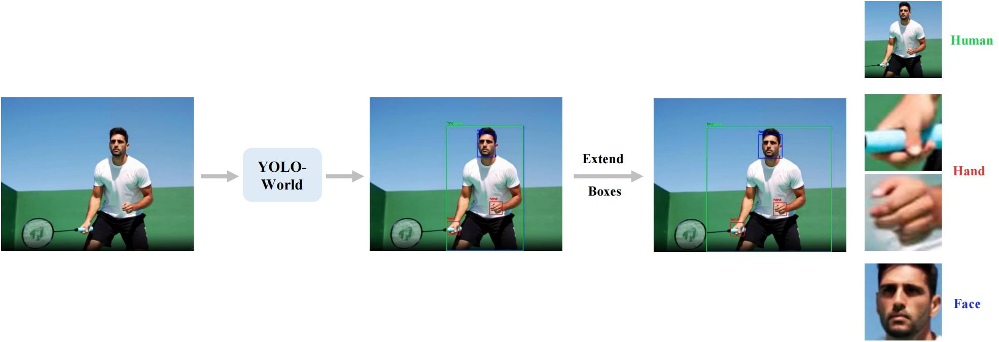
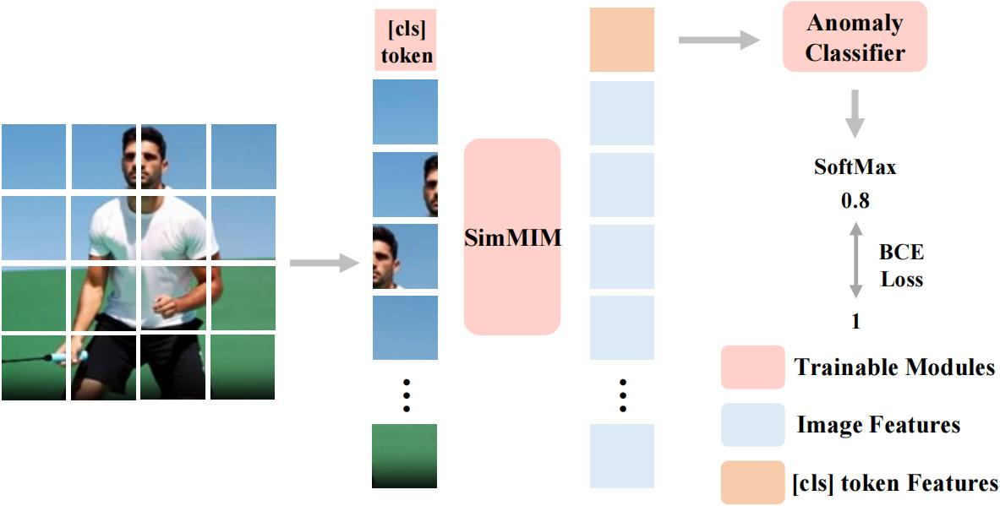
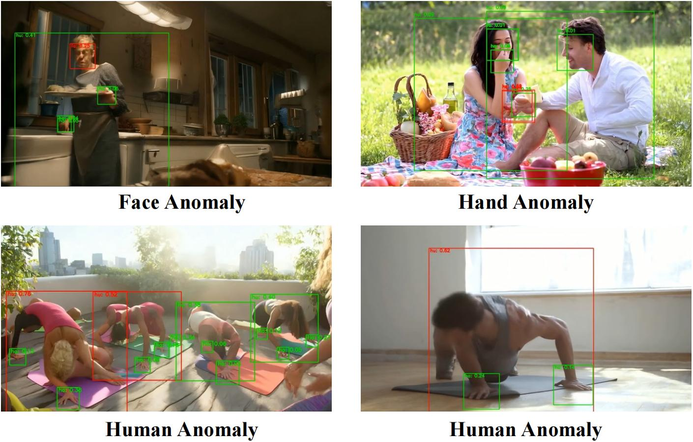
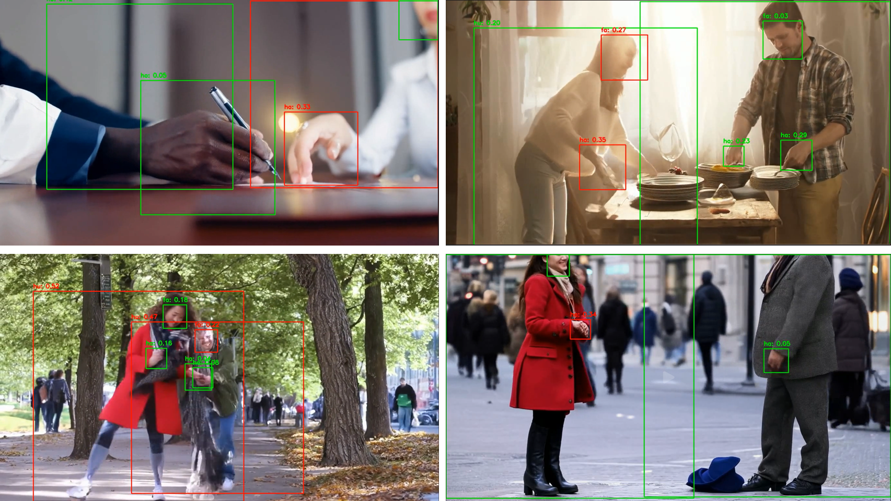
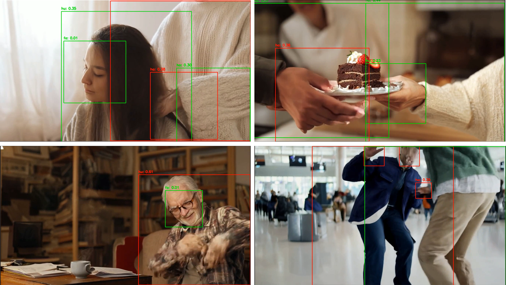

# Human Anomaly Dataset and Training Framework

This part provides an open-source dataset and training framework for Human Anomaly Detection.
---

## Data Structure

The dataset and related resources are organized as follows:

```
VBench-2.0_human_anomaly_root/
├── dataset/                # Main directory for the image dataset
│   ├── all_images.zip      # Compressed file containing all images
│   ├── face_train.jsonl    # Face training set annotations
│   ├── face_test.jsonl     # Face testing set annotations
│   ├── hand_train.jsonl    # Hand training set annotations
│   ├── hand_test.jsonl     # Hand testing set annotations
│   ├── human_train.jsonl   # Human training set annotations
│   ├── human_test.jsonl    # Human testing set annotations
├── src_video/              # Raw video data used to construct the dataset
│   ├── CogVideo/           # Videos generated by CogVideoX-1.5
│   ├── CogVideo-1.0/       # Videos generated by CogVideoX-1.0
│   ├── vad_real/           # Real-world videos
```

Each JSONL file contains annotations for the corresponding images. Each line in the JSONL file represents a single sample in the following format:
```json
["image_filename.jpg", label, score]
```

- `image_filename.jpg`: The base name of the image file.
- `label`: The ground truth label (e.g., class or pose information).
- `score`: Confidence score (unused).

---

## Framework

### Data Pre-processing for training and inference

- We first use YOLO-World as the open-vocaburary detector to detect the human in each frame, then detect the face and hand from the croped human image. The detection threshold is set to 0.1.
- To meet the input size requirement (square) of SimMIM, we extend the bounding boxes into square. 
- The human, face, hand will be saved to different folders for the following three anomaly detectors.
- We show the data processing pipeline below.
<p align="center">
  
</p>

### Training Pipeline

- We utilize the pre-trained weight of SimMIM and finetune the whole network with an additional anomaly detector that consists of a MLP layer.
- For the anomaly score, 0 means the image is normal and 1 means the image is abnormal, we use the binary cross entropy loss.
- The human, human face and human hand anomaly detectors need to be trained separately, the higher the score, the more possible it is an anomaly.
- We show the training pipeline below.
<p align="center">
  
</p>

### Inference Pipeline

- Given a generated video, we do frame-wise anomaly detection.
- Firstly, we detect and crop the human, human face and hand by YOLO-World as shown in ``data pre-processing`` in each frame.
- Then the detected image will be fed into corresponding anomaly detector with different anomaly threshold (i.e., 0.45, 0.3, 0.32 for human, human face, and human hands respectively).
- For each frame, we calculate the average score of the anomaly score of each human (sometimes there is more than one person in the frame). 
- For each human, it is flagged as abnormal if any of the three models predict an anomaly and the score will be 0, otherwise 1.
---

## How to Train

### Prerequisites
- Follow VBench2.0 environment set-up

### Steps to Train

1. **Download Pre-trained Model**:
   - Download the pre-trained SimMIM model from [Google Drive](https://drive.google.com/file/d/1dJn6GYkwMIcoP3zqOEyW1_iQfpBi8UOw/view?usp=sharing)
   - Download the pre-trained YOLO-World model from [Google Drive](https://drive.google.com/file/d/1qo-K1kum7yiEwIlN1TWDvABXX6qriUen/view?usp=drive_link)
   - put the models into `pretrain/`
   - or use the following command:
   ```bash
   gdown https://drive.google.com/uc?id=1dJn6GYkwMIcoP3zqOEyW1_iQfpBi8UOw -O pretrain/
   gdown https://drive.google.com/uc?id=1qo-K1kum7yiEwIlN1TWDvABXX6qriUen -O pretrain/
   ```

2. **Download Dataset**:
   - Download the dataset files from [Google Drive](https://drive.google.com/drive/folders/1_NyiLa861EbDQdDp4Lsy4jTzH2ynCiFw?usp=drive_link) or the following URL:
     ```bash
     git clone https://huggingface.co/datasets/Vchitect/VBench-2.0_human_anomaly
     ```
   - If the large folder does not download, use the following command (You need to configure Git LFS in advance, or we suggest using the Google Drive link above.):
      ```bash
      cd "VBench-2.0_human_anomaly"
      git lfs install
      git lfs pull
     ```

3. **Extract Images**:
   - Unzip the `opensource.zip` file:
      ```bash
      cd "VBench-2.0_human_anomaly"
      zip -s 0 --out merged.zip "opensource.zip"
      unzip merged.zip
      mv opensource/* ./
      rm -rf opensource
      rm merged.zip
      rm opensource.*
      ```

4. **Run Training**:
   - Execute the training code (we take face detector training as an example, for human and hand detectors, change the corresponding names):
     ```python
     torchrun --master_port 15690 main_finetune.py \
      --cfg 'configs/vit_base__800ep/simmim_finetune__vit_base__img224__800ep.yaml' \
      --train-path "VBench-2.0_human_anomaly/dataset/face_train.jsonl" \
      --val-path "VBench-2.0_human_anomaly/dataset/face_test.jsonl" \
      --pretrained 'pretrain/simmim_pretrain__vit_base__img224__800ep.pth' \
      --batch-size 128 \
      --output "checkpoint/face"
     ```


5. **Run Inference**:
   - Note that you need to train all of the three detectors to run the inference code (By default, we train for 30 epochs):
    ```python
    python inference.py \
      --cfg 'configs/vit_base__800ep/simmim_finetune__vit_base__img224__800ep.yaml' \
      --detector_config 'third_party/YOLO-World/yolo_world_v2_xl_vlpan_bn_2e-3_100e_4x8gpus_obj365v1_goldg_train_lvis_minival.py' \
      --detector_weights 'pretrain/yolo_world_v2_xl_obj365v1_goldg_cc3mlite_pretrain-5daf1395.pth' \
      --human_model 'checkpoint/human/ckpt29.pth' \
      --face_model 'checkpoint/face/ckpt29.pth' \
      --hand_model 'checkpoint/hand/ckpt29.pth' 
    ```

### Notes
- Ensure that all paths in the JSONL files correctly point to the extracted images.
- Modify the configuration file (`config.yaml` or similar) if you wish to customize training parameters.


### Results
- We show some results of our anomaly detector below
<p align="center">
  
</p>
More Cases
<p align="center">
  
</p>
<p align="center">
  
</p>

<a name="citation_and_acknowledgement"></a>
## :black_nib: Citation

   If you find our repo useful for your research, please consider citing our paper:

   ```bibtex
    @article{zheng2025vbench2,
        title={{VBench-2.0}: Advancing Video Generation Benchmark Suite for Intrinsic Faithfulness},
        author={Zheng, Dian and Huang, Ziqi and Liu, Hongbo and Zou, Kai and He, Yinan and Zhang, Fan and Zhang, Yuanhan and He, Jingwen and Zheng, Wei-Shi and Qiao, Yu and Liu, Ziwei},
        journal={arXiv preprint arXiv:2503.21755},
        year={2025}
    }

    @InProceedings{huang2023vbench,
        title={{VBench}: Comprehensive Benchmark Suite for Video Generative Models},
        author={Huang, Ziqi and He, Yinan and Yu, Jiashuo and Zhang, Fan and Si, Chenyang and Jiang, Yuming and Zhang, Yuanhan and Wu, Tianxing and Jin, Qingyang and Chanpaisit, Nattapol and Wang, Yaohui and Chen, Xinyuan and Wang, Limin and Lin, Dahua and Qiao, Yu and Liu, Ziwei},
        booktitle={Proceedings of the IEEE/CVF Conference on Computer Vision and Pattern Recognition},
        year={2024}
    }

    @article{huang2024vbench++,
        title={{VBench++}: Comprehensive and Versatile Benchmark Suite for Video Generative Models},
        author={Huang, Ziqi and Zhang, Fan and Xu, Xiaojie and He, Yinan and Yu, Jiashuo and Dong, Ziyue and Ma, Qianli and Chanpaisit, Nattapol and Si, Chenyang and Jiang, Yuming and Wang, Yaohui and Chen, Xinyuan and Chen, Ying-Cong and Wang, Limin and Lin, Dahua and Qiao, Yu and Liu, Ziwei},
        journal={arXiv preprint arXiv:2411.13503},
        year={2024}
    }

   ```


## :hearts: Acknowledgement

**VBench-2.0** is currently maintained by [Dian Zheng](https://zhengdian1.github.io/), [Ziqi Huang](https://ziqihuangg.github.io/) and [Kai Zou](https://github.com/Jacky-hate).

#### :hugs: Open-Sourced Repositories
This project wouldn't be possible without the following open-sourced repositories: [YOLO_World](https://github.com/AILab-CVC/YOLO-World), [SimMIM](https://github.com/microsoft/SimMIM)

---

## License

This project is released under the [MIT License](LICENSE). You are free to use, modify, and distribute the dataset and code for academic and commercial purposes, provided you include proper attribution.

---


