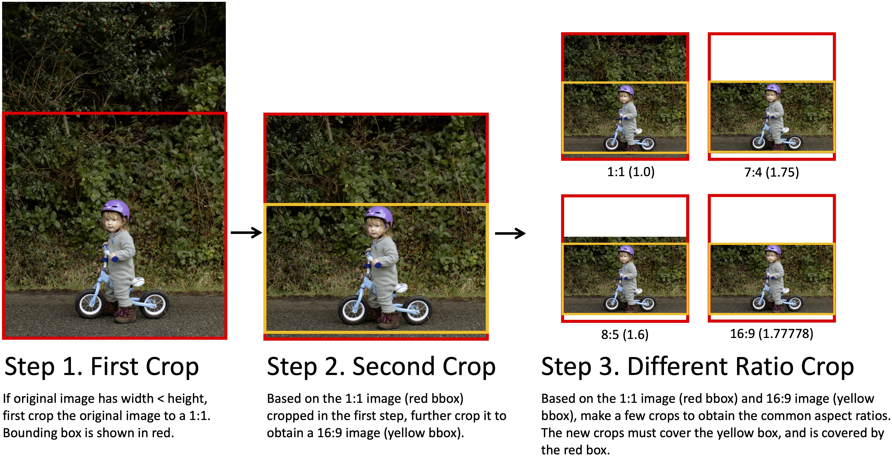

# VBench-I2V (Beta Version, Mar 2024)

VBench now supports evaluating Image-to-Video (I2V) generation models.

## 1. :fire: Highlights 
- 🖼️ Image Suite: multi-scale, multi-aspect-ratio, comprehensive content variety
- 📏 Dimensions: video-image consistency, camera motion, video quality, etc.

## 2. :bookmark_tabs: I2V Image Suite

[](https://drive.google.com/drive/folders/1fdOZKQ7HWZtgutCKKA7CMzOhMFUGv4Zx?usp=sharing)


We provide a suite of input images in order to benchmark the Image-to-Video (I2V) task.


### 2.1. What's Special about VBench-I2V's Image Suite
1. **Main philosophy behind our Image Suite**: :bulb: ***Adaptive aspect ratio*** :bulb:
*Since different Image-to-Video (I2V) models have different default resolutions for the input images, we believe it's only fair to compare models when each model is evaluated on its default / best resolution. To this end, we introduced an automatic pipeline to obtain images in different resolutions and aspect ratios while preserving their main content*. More implementation details are provided [here](#crop).

2. ***Diverse and fair content for both foreground and background***.
We ensure that the image content is diverse, in terms of several aspects: scene category, object type, fairness of human-centric images, etc. More statistics will be released [here](#content).

3. ***High resolution***.
The original images are of very high resolutions (mainly around 4k and above), and this enable many tasks that requires high-resolution and high quality images.
    <p>
        <br>
        <em>The figure above shows the image resolution distribution in our image suite. Each dot represents an image in our image suite. The three reference lines represent 1K (red), 2K (green), and 4K (yellow) resolutions.
        </em>
    </p>
    <table>
        <tr>
            <th style="background-color: #e0e0e0;">Image Resolution</th>
            <th style="background-color: #e0e0e0;">Image Area</th>
            <th style="background-color: #e0e0e0;">Percentage</th>
            <th style="background-color: #e0e0e0;">Image Side Length</th>
            <th style="background-color: #e0e0e0;">Percentage</th>
        </tr>
        <tr>
            <td style="background-color: #f8f8f8;">res < 1K</td>
            <td style="background-color: #ffffff;">WxH < 1920x1080</td>
            <td style="background-color: #ffffff;">0.0%</td>
            <td style="background-color: #f8f8f8;">W<1920 or H<1080</td>
            <td style="background-color: #f8f8f8;">0.3%</td>
        </tr>
        <tr>
            <td style="background-color: #f8f8f8;">1K <= res < 2K</td>
            <td style="background-color: #ffffff;">1920x1080 <= WxH < 2560x1440</td>
            <td style="background-color: #ffffff;">3.4%</td>
            <td style="background-color: #f8f8f8;">(1920 <= W and 1080 <= H) and (W<2560 or H<1440)</td>
            <td style="background-color: #f8f8f8;">5.4%</td>
        </tr>
        <tr>
            <td style="background-color: #f8f8f8;">2K <= res < 4K</td>
            <td style="background-color: #ffffff;">2560x1440 <= WxH < 3840x2160</td>
            <td style="background-color: #ffffff;">6.8%</td>
            <td style="background-color: #f8f8f8;">(2560 <= W and 1440 <= H) and (W<3840 or H<2160)</td>
            <td style="background-color: #f8f8f8;">23.1%</td>
        </tr>
        <tr>
            <td style="background-color: #f8f8f8;">4K <= res < 8K</td>
            <td style="background-color: #ffffff;">3840x2160 <= WxH < 7680x4320</td>
            <td style="background-color: #ffffff;">85.6%</td>
            <td style="background-color: #f8f8f8;">(3840 <= W and 2160 <= H) and (W<7680 or H<4320)</td>
            <td style="background-color: #f8f8f8;">68.7%</td>
        </tr>
        <tr>
            <td style="background-color: #f8f8f8;">8K = res</td>
            <td style="background-color: #ffffff;">7680x4320 <= WxH</td>
            <td style="background-color: #ffffff;">4.2%</td>
            <td style="background-color: #f8f8f8;">7680 <= W and 4320 <= H</td>
            <td style="background-color: #f8f8f8;">2.5%</td>
        </tr>
    </table>
<!--     
| Image Resolution | Image Area | Percentage | Image Side Length | Percentage
| :--------: | :--------: | :--------: | :--------: | :--------: |
| res < 1K | WxH < 1920x1080 | 0.0% | W<1920 or H<1080 | 0.3% <tr></tr> |
| 1K <= res < 2K | 1920x1080 <= WxH < 2560x1080 | 3.4% | (1920 <= W and 1080 <= H) and (W<2560 or H<1440) | 5.4% <tr></tr> |
| 2K <= res < 4K | 2560x1080 <= WxH < 3840x2160 | 6.8% | (2560 <= W and 1440 <= H) and (W<3840 or H<2160) | 23.1% <tr></tr> |
| 4K <= res < 8K | 3840x2160 <= WxH < 7680x4320 | 85.6% | (3840 <= W and 2160 <= H) and (W<7680 or H<4320) | 68.7% <tr></tr> |
| 8K= res | 7680x4320 <= WxH | 4.2% | 7680 <= W and 4320 <= H | 2.5% <tr></tr> | -->


4. ***Text prompts paired with the images***.
For each input image, we carefully designed text prompt via a series of captioning techniques. See more details [here](#caption).


### 2.2. Download

You can access our image suite on [Google Drive](https://drive.google.com/drive/folders/1fdOZKQ7HWZtgutCKKA7CMzOhMFUGv4Zx?usp=sharing). 

**Automatic Download**
- You can use the following script to automatically obtain our image suite.
- First install `gdown`,
    ```
    pip install gdown
    ```
- Then run this script to download the image suite.
    ```
    sh vbench2_beta_i2v/download_data.sh
    ```

**What data do we provide**
- `origin.zip`: the original images 
- `crop.zip`: images cropped to different resolutions
- `i2v-bench-info.json`: the corresponding meta information for each image
- `origin`: unzipped version of `origin.zip` for online viewing
- `crop`: unzipped version of `crop.zip` for online viewing


### 2.3. Meta Information

The `i2v-bench-info.json` file contains the meta information for each image, including the `filename`, `category`, `url`, `crop_info`, and `caption`, for example:

```json
[
    {
        "file_name": "a beach with a lot of buildings on the side of a cliff.jpg",
        "url": "www.pexels.com/photo/colorful-cliffside-village-3225528",
        "type": "architecture",
        "origin_width": 4882,
        "origin_height": 6102,
        "first_crop": {  # 1-1
            "width": 4882,
            "height": 6102,
            "first_bbox": [0, 530, 4882, 4882]  # relative to the original image
        },
        "second_crop": {  # 16-9
            "width": 4882,
            "height": 4882,
            "second_bbox": [0, 1094, 4880, 2745]  # relative to the first cropped image
        },
        "diff_ratio_crop": {  # relative to the original image
            "1-1": [0, 530, 4882, 4882],
            "8-5": [0, 1345, 4880, 3050],
            "7-4": [0, 1584, 4879, 2788],
            "16-9": [0, 1624, 4880, 2745]
        },
        "caption": "a beach with a lot of buildings on the side of a cliff"
    },
    {
        "file_name": "a squirrel sitting on the ground eating a piece of bread.jpg",
        "url": "www.pexels.com/photo/photography-of-brown-chipmunk-eating-on-top-of-rock-751829",
        "type": "animal",
        "origin_width": 3381,
        "origin_height": 2254,
        "first_crop": {  # 16-9
            "width": 3381,
            "height": 2254,
            "first_bbox": [0, 252, 3376, 1899]  # relative to the original image
        },
        "second_crop": {  # 1-1
            "width": 3376,
            "height": 1899,
            "second_bbox": [720, 0, 1899, 1899]  # relative to the first cropped image
        },
        "diff_ratio_crop": {  # relative to the original image
            "1-1": [720, 252, 1899, 1899],
            "8-5": [26, 252, 3032, 1895],
            "7-4": [3, 252, 3318, 1896],
            "16-9": [0, 252, 3376, 1899]
        },
        "caption": "a squirrel sitting on the ground eating a piece of bread"
    },
]
```

About bounding box:
- The 4 numbers in `bbox` is [x, y, w, h].
- `first_crop` `bbox` is relative to original image. 
- `second_crop` `bbox` is relative to the `first_crop` image. 
- `diff_ratio_crop` `bbox` is relative to original image.


<a name="crop"></a>
### 2.4. Image Cropping Pipeline


We provide ready-to-download images in four common aspect ratios: `1:1`, `8:5`, `7:4`, and `16:9`. We also support cropping the original image to any user-customized aspect ratio between `1:1` and `16:9`, like `5:4`. 

**Open-sourced cropping pipeline**

- Before cropping, you first need to use the `download_data.sh` script to download the image data to the specified path.
- Then run the automatic cropping script:
    ```python
    python vbench2_beta_i2v/crop_to_diff_ratio.py --target_ratio <target_ratio>
    ```
    For example,
    ```python
    python vbench2_beta_i2v/crop_to_diff_ratio.py --target_ratio 5-4   # or 13-8
    ```
- You can use `result_path` to specify the location to store the output results.
    ```python
    python vbench2_beta_i2v/crop_to_diff_ratio.py --target_ratio <target_ratio> --result_path <result_path>
    ```
    For example:
    ```python
    python vbench2_beta_i2v/crop_to_diff_ratio.py --target_ratio 5-4 --result_path vbench2_beta_i2v/data/target_crop
    ```
**How does the cropping pipeline work?**
- The figures below show the image cropping pipeline. For each "original image" (i.e., the raw image), we manually label the red bbox and yellow bbox for extreme aspect ratios, while ensuring that both the red and yellow bbox contain the main content / subject of the image. Then the rest of the common aspect ratios can be viewed as interpolants of the red and yellow boxes, and can be produced automatically.
    <p>
        <br>
        <em>Cropping pipeline when the original image is "landscape" ratio.</em><br><br>
        <br>
        <em>Cropping pipeline when the original image is "portrait" ratio.</em><br>
    </p>

<a name="content"></a>
### 2.5. Image Content
The images contain `subject` (*i.e.*, with foreground) and `background`, and are further divided into `11 categories`:
```
- subject
    - single-human
    - multiple-human
    - animal
    - transportation
    - food
    - plant
    - other
- background
    - architecture
    - scenery
    - indoor
    - abstract
```

This information is recorded in `vbench2_beta_i2v/data/i2v-bench-info.json`, under `type` key for each image. It is also recorded in `vbench2_beta_i2v/vbench2_i2v_full_info.json`, under `image_type` key for each image. More statistics will be released.

<a name="caption"></a>
### 2.6. Captions

First, we use captioning models like [CoCa](https://laion.ai/blog/coca/) and [BLIP2](https://github.com/salesforce/LAVIS/blob/main/examples/blip2_instructed_generation.ipynb) to generate captions for each image. Then, we manually screen and optimize the captions generated for each image. For example, we remove expressions referring to the image, such as "an image of" or "a picture of", modify descriptions that do not match the image, and add descriptions about motion.


## 3. Dimension Suite

**Video-Image Alignment | Subject Consistency**
- This dimension evaluates the alignment between the subject in the input image and the subject in the resulting video. We make use of [DINO](https://github.com/facebookresearch/dino) features, with carefully designed order-statistics schemes.

**Video-Image Alignment | Background Consistency**
- This dimension assesses the coherence between the background scene in the input image and the generated video. We make use of [DINO](https://github.com/facebookresearch/dino) features, with carefully designed order-statistics schemes.

**Video-Text Alignment | Camera Motion**
- This dimension assesses whether the generated video adheres to the camera control instructions specified in the prompt. We make use of [Co-Tracker](https://github.com/facebookresearch/co-tracker), with carefully designed rules to predict the camera motion type.


## 4. Video Data
To prepare the sampled videos for evaluation:
- For each image-prompt pair, sample 5 videos.
- **Random Seed**: At the beginning of sampling, set the random seed. For some models, the random seed is independently and randomly drawn for each video sample, and this is also acceptable, but it would be the best to record the random seed of every video being sampled. We need to ensure: (1) The random seeds are random, and not cherry picked. (2) The sampling process is reproducible, so that the evaluation results are reproducible.
- Name the videos in the form of `$prompt-$index.mp4`, `$index` takes value of `0, 1, 2, 3, 4`. For example:
    ```                   
    ├── A teddy bear is climbing over a wooden fence.-0.mp4                                       
    ├── A teddy bear is climbing over a wooden fence.-1.mp4                                       
    ├── A teddy bear is climbing over a wooden fence.-2.mp4                                       
    ├── A teddy bear is climbing over a wooden fence.-3.mp4                                       
    ├── A teddy bear is climbing over a wooden fence.-4.mp4                                       
    ├── A person is whisking eggs, and the egg whites and yolks are gently streaming out-0.mp4                                                                      
    ├── A person is whisking eggs, and the egg whites and yolks are gently streaming out-1.mp4                                                                      
    ├── A person is whisking eggs, and the egg whites and yolks are gently streaming out-2.mp4                                                                      
    ├── A person is whisking eggs, and the egg whites and yolks are gently streaming out-3.mp4                                                                      
    ├── A person is whisking eggs, and the egg whites and yolks are gently streaming out-4.mp4 
    ......
    ```

#### Pseudo-Code for Sampling
- If you want to evaluate certain dimensions, below are the pseudo-code for sampling.
    ```python
    dimension_list = ["i2v_subject", "i2v_background", "camera_motion"]

    for dimension in dimension_list:

        # set random seed
        if args.seed:
            torch.manual_seed(args.seed)    
        
        # prepare inputs

        image_folder = "./vbench2_beta_i2v/data/crop/{resolution} # resolution = 1-1/8-5/7-4/16-9
        info_list = json.load(open("./vbench2_beta_i2v/vbench2_i2v_full_info.json", "r"))
        inputs = [(os.path.join(image_folder, info["image_name"]), info["prompt_en"]) for info in info_list if dimension in info["dimension"]]
        
        for image_path, prompt in inputs:

            # sample 5 videos for each prompt
            for index in range(5):

                # perform sampling
                video = sample_func(image_path, prompt, index)    
                cur_save_path = f'{args.save_path}/{prompt}-{index}.mp4'
                torchvision.io.write_video(cur_save_path, video, fps=fps, video_codec='h264', options={'crf': '10'})
    ```


#### Evaluation Setting
- For different ability dimensions, we use different benchmark data for evaluation. Our evaluation code use `vbench2_i2v_full_info.json` to automatically obtain the corresponding data for different dimensions on-the-fly.
- The tables below show the images suite benchmark used for different dimensions:
    | Video-Condition Dimension | Subject Data | Background Data |
    | :---: | :---: | :---: |
    | `i2v_subject` | Yes | - | 
    | `i2v_background` | - | Yes |
    | `camera_motion` | - | Yes |

    | Video-Quality Dimension | Subject Data | Background Data |
    | :---: | :---: | :---: |
    | `subject_consistency` | Yes | - |
    | `background_consistency` | - | Yes |
    | `motion_smoothness` | Yes | - |
    | `dynamic_degree` | Yes | - |
    | `aesthetic_quality` | Yes | Yes |
    | `imaging_quality` | Yes | Yes |


## 5. Evaluation

We have introduced three new dimensions for the image-to-video task, namely: `i2v_subject`, `i2v_background`, and `camera_motion`. 

To perform evaluation, use the following script:
```python
from vbench2_beta_i2v import VBenchI2V
my_VBench = VBenchI2V("cuda", <path/to/vbench2_i2v_full_info.json>, <path/to/save/dir>)
my_VBench.evaluate(
    videos_path = <video_path>,
    name = <name>,
    dimension_list = [<dimension>, <dimension>, ...],
    resolution = <resolution>
)
```
The `resolution` parameter specifies the image resolution. You can select the suitable ratio according to the video resolution, with options including 1:1, 8:5, 7:4, and 16:9.

For example: 
```python
from vbench2_beta_i2v import VBenchI2V
my_VBench = VBenchI2V("cuda", "vbench2_beta_i2v/vbench2_i2v_full_info.json", "evaluation_results")
my_VBench.evaluate(
    videos_path = "sampled_videos",
    name = "i2v_subject",
    dimension_list = ["i2v_subject"],
    resolution = "1-1"
)
```

<!-- For video quality dimensions, including `subject consistency`, `background_consistency`, `motion_smoothness`, `dynamic_degree`, `aesthetic_quality`, `imaging_quality`, you can refer to the script below.
```python
from vbench import VBench
my_VBench = VBench("cuda", <path/to/vbench2_i2v_full_info.json>, <path/to/save/dir>)
my_VBench.evaluate(
    videos_path = <video_path>,
    name = <name>,
    dimension_list = [<dimension>, <dimension>, ...],
)
```
For example: 
```python
from vbench import VBench
my_VBench = VBench("cuda", "vbench2_beta_i2v/vbench2_i2v_full_info.json", "evaluation_results")
my_VBench.evaluate(
    videos_path = "sampled_videos",
    name = "subject_consistency",
    dimension_list = ["subject_consistency"],
) 
``` -->

To perform evaluation on one dimension, run this:
```
python evaluate_i2v.py \
    --videos_path $VIDEOS_PATH \
    --dimension $DIMENSION \
    --ratio $RATIO
```

- The complete list of dimensions:
    ```
    ['subject_consistency', 'background_consistency', 'temporal_flickering', 'motion_smoothness', 'dynamic_degree', 'aesthetic_quality', 'imaging_quality', 'i2v_subject', 'i2v_background', 'camera_motion']
    ```


## :black_nib: Citation

   If you find VBench-I2V useful for your work, please consider citing our paper and repo:

   ```bibtex
    @InProceedings{huang2023vbench,
        title={{VBench}: Comprehensive Benchmark Suite for Video Generative Models},
        author={Huang, Ziqi and He, Yinan and Yu, Jiashuo and Zhang, Fan and Si, Chenyang and Jiang, Yuming and Zhang, Yuanhan and Wu, Tianxing and Jin, Qingyang and Chanpaisit, Nattapol and Wang, Yaohui and Chen, Xinyuan and Wang, Limin and Lin, Dahua and Qiao, Yu and Liu, Ziwei},
        booktitle={Proceedings of the IEEE/CVF Conference on Computer Vision and Pattern Recognition},
        year={2024}
    }

    @article{huang2023vbenchgithub,
        author = {VBench Contributors},
        title = {VBench},
        year = {2023},
        publisher = {GitHub},
        journal = {GitHub repository},
        howpublished = {\url{https://github.com/Vchitect/VBench}},
    }    
   ```


## :hearts: Acknowledgement

**VBench-I2V** is currently maintained by [Ziqi Huang](https://ziqihuangg.github.io/) and [Fan Zhang](https://github.com/zhangfan-p).

The images are sourced from [Pexels](https://www.pexels.com) and [Pixabay](https://pixabay.com).

We made use of [DINO](https://github.com/facebookresearch/dino) and [Co-Tracker](https://github.com/facebookresearch/co-tracker).
